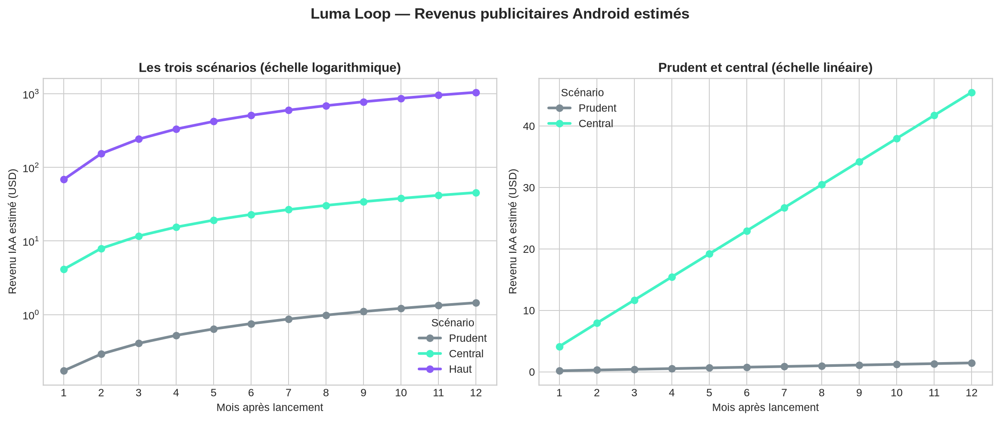

# Monétisation publicitaire et prévisionnel — Luma Loop

**Entité :** Flash Digital SAS  
**Produit :** Luma Loop, jeu d’arcade tactile free-to-play  
**Périmètre :** Android / Google Play, publicité récompensée uniquement  
**Date d’analyse :** 27 août 2026  
**Statut :** prévision de gestion; elle ne constitue pas une promesse de revenus.

> **Avertissement :** je suis une IA, pas un conseiller financier agréé. Cette analyse est fondée sur des benchmarks publics et des hypothèses de lancement explicites; les revenus réels dépendent principalement de l’audience, de sa géographie, de la rétention et de la demande publicitaire.

## Conclusion rapide

La publicité peut financer un jeu gratuit comme Luma Loop, mais elle devient économiquement intéressante **après** l’obtention d’une audience active régulière. Avec un jeu de ce format, l’unité économique saine est une **publicité vidéo récompensée, volontaire**, placée dans un moment de pause naturel et donnant une contrepartie non essentielle, par exemple une seconde chance ou un bonus cosmétique. Ce format respecte davantage la session courte qu’une bannière permanente ou un interstitiel imposé au milieu de l’action.

Le scénario central du modèle, qui retient 33 000 installations cumulées sur douze mois et un eCPM Android Europe de 5,10 USD, ne produit que **297,89 USD** sur l’année, avant impôts et coûts. Le scénario haut atteint **6 663,90 USD** sur douze mois, mais requiert 162 000 installations et une audience quotidienne moyenne de 2 436 joueurs. Il faut donc considérer la publicité comme un **complément de financement progressif**, non comme une source de revenu significative au lancement.

## Comment fonctionne la rémunération publicitaire

Une régie publicitaire, telle qu’AdMob associée à une solution de médiation, propose une publicité lorsqu’un emplacement est déclenché dans le jeu. Les annonceurs enchérissent pour l’impression selon le format, le pays, l’appareil, le profil de consentement et la demande du moment. Le jeu reçoit un revenu uniquement lorsqu’une impression est effectivement diffusée. L’**eCPM** est le revenu éditeur pour 1 000 impressions et se calcule ainsi :

> **Revenu publicitaire = impressions servies × eCPM ÷ 1 000.**

Le taux de remplissage mesure la part des opportunités qui trouvent effectivement une publicité. Ainsi, même si un joueur peut demander une publicité récompensée, le revenu reste nul si aucun annonceur ne remplit cet emplacement. L’eCPM varie fortement : les États-Unis, le Japon et l’Australie sont généralement plus rémunérateurs que les marchés émergents; il monte aussi pendant certaines périodes commerciales. Une médiation entre plusieurs réseaux peut accroître la concurrence pour chaque impression, mais elle complexifie l’intégration, l’audit des données et les déclarations de confidentialité.[1] [2]

Pour une application gratuite financée par annonces, Google Play ne facture pas une commission sur le revenu publicitaire. Les frais de service Google Play concernent les applications payantes, les achats numériques intégrés et les abonnements vendus via sa facturation. La régie applique ensuite ses propres conditions commerciales; ses montants versés apparaissent dans son tableau de bord et font l’objet de son cycle de paiement.[3]

| Étape | Ce qui se passe | Indicateur à suivre |
|---|---|---|
| 1. Intégration | Le jeu intègre un SDK de régie/médiation, des identifiants d’application et des unités publicitaires. | Aucun SDK actif dans Luma Loop 1.0.0. |
| 2. Consentement et conformité | La régie traite les paramètres de confidentialité; les déclarations Data safety, « Contains ads » et la politique sont mises à jour. | Aucun suivi ou publicité ne peut être activé avant cet audit. |
| 3. Opportunité | Le joueur atteint une pause naturelle et choisit éventuellement de voir une récompense. | Opportunités rewarded par DAU et par jour. |
| 4. Enchère et diffusion | Les réseaux mis en concurrence servent une publicité si une demande existe. | Fill rate et eCPM par pays / format. |
| 5. Paiement | La régie crédite le revenu correspondant aux impressions servies. | Revenu, ARPDAU, délai et seuil de paiement. |

## Pourquoi le format récompensé est le seul recommandé ici

Luma Loop est conçu autour d’une action tactile simple et d’un rythme calme. Une bannière, même discrète, pénaliserait le rendu premium pour un eCPM Android Europe indicatif de **0,20 USD**, tandis que les formats interstitiel et récompensé se situent à **5,10 USD** dans le même benchmark régional. Le jeu ne doit pas multiplier artificiellement les opportunités pour compenser ce différentiel, car une baisse de la rétention détruirait à terme davantage de revenus qu’elle n’en crée.[1]

| Format | Décision pour Luma Loop | Raisonnement |
|---|---|---|
| Bannière | À éviter | Revenu relatif faible et pollution visuelle permanente. |
| Interstitiel forcé | À éviter au lancement | Risque élevé de rupture du rythme, particulièrement pour les joueurs de 6–12 ans. |
| Vidéo récompensée | À tester après validation de la rétention | Choisie volontairement, avec une récompense explicite et sans verrouiller l’expérience principale. |
| Offerwall | Hors périmètre | Inadapté à un jeu simple visant aussi des enfants; complexité et risques de conformité supérieurs. |

La version 1.0.0 doit donc rester **sans publicité**. Le produit dispose déjà d’une préférence locale préparatoire, mais cette préférence ne suffit pas à activer une régie. Une version ultérieure nécessiterait un SDK audité, une mise à jour de `PRIVACY.md`, des réponses Data safety exactes, l’activation du label « Contains ads » dans Play Console et une revue Families dédiée, car le public cible inclut les 6–12 ans.[4]

## Hypothèses de prévision

Le modèle isole le revenu publicitaire Android. Il n’intègre pas les dépenses d’acquisition, les salaires, les coûts de production créative, les impôts, les éventuels frais de médiation ni le temps de support. Les trois scénarios sont donc des **références de volume**, pas un budget complet de Flash Digital SAS.

Le scénario central emploie un eCPM de **5,10 USD**, benchmark Android Europe publié pour les vidéos récompensées. Les scénarios prudent et haut utilisent respectivement 3,00 USD et 8,00 USD comme bornes de sensibilité. La rétention et la fréquence ne sont pas des résultats observés de Luma Loop; ce sont des hypothèses à remplacer par les mesures de la version commercialisée. À titre de contexte, GameAnalytics observe sur son échantillon européen médian D1 21,4 %, D7 4,31 % et D28 1,21 %; cela illustre la difficulté de conserver une audience, sans prédire le comportement de Luma Loop.[1] [5]

| Hypothèse | Prudent | Central | Haut |
|---|---:|---:|---:|
| Nouvelles installations — mois 1 | 100 | 500 | 2 000 |
| Nouvelles installations — mois 12 | 800 | 5 000 | 25 000 |
| Part des MAU précédents encore actifs | 5 % | 10 % | 20 % |
| DAU / MAU | 8 % | 10 % | 15 % |
| Opportunités rewarded / DAU / jour | 0,30 | 0,60 | 1,00 |
| Fill rate | 80 % | 90 % | 95 % |
| eCPM rewarded | 3,00 USD | 5,10 USD | 8,00 USD |

La formule appliquée chaque mois est :

> **Revenu = DAU × 30 jours × opportunités rewarded par DAU × fill rate × eCPM ÷ 1 000.**

## Résultats du prévisionnel à 12 mois

| Résultat | Prudent | Central | Haut |
|---|---:|---:|---:|
| Installations cumulées | 5 400 | 33 000 | 162 000 |
| DAU moyen | 38 | 300 | 2 436 |
| Revenu IAA cumulé | 9,75 USD | 297,89 USD | 6 663,90 USD |
| Revenu IAA — mois 12 | 1,45 USD | 45,48 USD | 1 046,40 USD |
| DAU nécessaires à 1 000 USD / mois | 46 296 | 12 104 | 4 386 |

La lecture économique est directe : les revenus publicitaires ne dépendent pas tant du nombre total de téléchargements que de la capacité à maintenir des **DAU**. Le modèle central exige plus de 12 000 DAU réguliers pour atteindre 1 000 USD de revenu IAA mensuel. Avec ce jeu, rechercher ce volume avant d’investir dans l’acquisition payante est plus pertinent que d’ajouter rapidement plusieurs formats publicitaires.

Le fichier de calcul joint au projet contient les hypothèses, les formules, les commentaires de sources et les trois scénarios modifiables : [`financials/luma_loop_ad_forecast.xlsx`](financials/luma_loop_ad_forecast.xlsx). Les cellules d’hypothèses y sont bleues; les calculs sont liés par formule afin de permettre à Flash Digital SAS de remplacer chaque hypothèse par les mesures réelles après lancement.

## Décision recommandée et seuils de pilotage

Je recommande de lancer Luma Loop sans publicité, puis de piloter une décision de mise à jour à partir de données réelles. L’objectif n’est pas d’attendre une valeur absolue arbitraire, mais de confirmer que le jeu donne envie de revenir avant de le monétiser.

| Moment | Décision proposée | Seuil ou vérification |
|---|---|---|
| Lancement 1.0.0 | Aucune publicité. | Récolter retours qualitatifs, installations organiques et rétention; ne pas modifier la boucle pour un revenu marginal. |
| Après échantillon réel | Préparer un test rewarded unique. | Retention D1 et D7 conformes ou supérieures à la médiane régionale pertinente; aucun signal de frustration sur la difficulté. |
| Test de monétisation | Une seule publicité récompensée optionnelle, par exemple après une partie terminée. | Suivre opt-in, fill rate, eCPM, ARPDAU et rétention du groupe exposé. |
| Passage à l’échelle | Ajouter une médiation uniquement si la rétention est stable. | LTV publicitaire supérieur au coût d’acquisition avec une marge de sécurité; aucun recul significatif de D1/D7. |

L’usage de la publicité devient donc intéressant si Luma Loop réussit à constituer une base de plusieurs milliers de joueurs actifs quotidiens dans des marchés monétisables, sans altérer son expérience. Pour l’état actuel du produit, la priorité de Flash Digital SAS doit rester la **distribution organique, la qualité du premier jour et la rétention**, plutôt que le rendement immédiat d’une régie.

## Méthodologie, limites et sources

**Base de calcul.** Les revenus sont le produit des DAU, de 30 jours, des opportunités rewarded, du fill rate et d’un eCPM, divisé par 1 000. Le montant est présenté en USD car les benchmarks publicitaires le sont; aucune conversion EUR n’est appliquée.

**Date de référence.** Le modèle est préparé le 27 août 2026. Les benchmarks de rétention citent des données 2024, publiées/mises à jour en 2026; le benchmark eCPM consulté est daté du 13 mars 2026. Les taux publicitaires changent selon les pays, les saisons et les plateformes.

**Hypothèses.** Les installations, taux de retour mensuel, ratios DAU/MAU, opportunités et fill rates sont des scénarios de management, et non des données historiques de Luma Loop. La borne centrale de 5,10 USD est un repère public Android Europe, pas un engagement de paiement.

**Sources et confiance.** La définition eCPM et le benchmark rewarded Android Europe proviennent de Mistplay, qui reproduit des données Appodeal; la rétention de contexte provient de l’échantillon multi-jeux de GameAnalytics. Ces sources sont utiles pour définir une fourchette, mais ne remplacent pas les rapports réels de la régie après lancement. La confiance est **faible à moyenne** sur les montants prospectifs et **élevée** sur l’arithmétique du modèle.

**Conformité.** Cette analyse est une recherche et un outil de gestion, pas un conseil financier personnalisé. L’ajout d’un SDK publicitaire impose une nouvelle revue des obligations Google Play et des informations de confidentialité.

## Références

[1] [Mistplay — Mobile ads eCPM: Basics and latest data, 13 mars 2026](https://business.mistplay.com/resources/mobile-ads-ecpm)

[2] [Tenjin — Ad Monetization in Mobile Games: Benchmark Report 2026](https://tenjin.com/blog/ad-mon-gaming-2026/)

[3] [Google Play — Service fees](https://support.google.com/googleplay/android-developer/answer/112622?hl=en)

[4] [Google Play — Prepare your app for review](https://support.google.com/googleplay/android-developer/answer/9859455?hl=en)

[5] [GameAnalytics — 2025 Mobile Gaming Benchmarks](https://www.gameanalytics.com/reports/2025-mobile-gaming-benchmarks)
